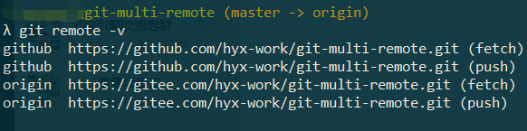

# git-multi-remote

#### 介绍
git 多个远程仓库配置

#### 项目初始化

```bash
git init 
git config  user.name "abc"
git config user.email "abc@11.com"
# 可以查查起效没
git config --list

git add .
git commit -m "git 多个远程分支配置说明"
```

#### 项目多个远程库配置

以本项目为例，在github上创建一个空仓库，https://github.com/hyx-work/git-multi-remote.git

以本项目为例，在gitee上创建一个空仓库https://gitee.com/hyx-work/git-multi-remote.git

```bash
git remote add origin https://gitee.com/hyx-work/git-multi-remote.git
git remote add github https://github.com/hyx-work/git-multi-remote.git
```

查看远程仓库配置




#### 推送到远程仓库


* gitee


```bash
git push -u origin master
```


* github

```bash
github默认主分支为main，强推一下
git push github master  --force

后续再推送可以
git push github
```


